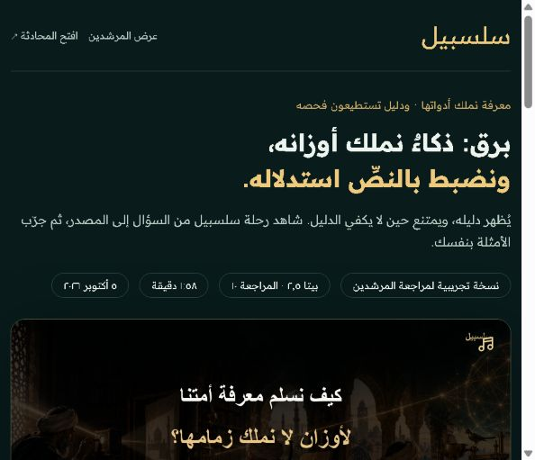

# برق للمحتوى الإسلامي | سلسبيل

**برق: ذكاءٌ نملك أوزانه، ونضبط بالنصِّ استدلاله؛ يُظهر دليله، ويمتنع حين لا يكفي الدليل.**

[جرّب المحادثة](https://islamicaich.salsabeel.ai/) · [شاهد الفيلم — ١:٥٨](https://islamicaich.salsabeel.ai/beta/2-5/) · [عرض المرشدين](https://islamicaich.salsabeel.ai/reports/mentors-briefing) · [ابدأ مراجعة الأدلة](evidence/README.md)

## المشكلة التي نعالجها

يحتاج الباحث في المعرفة الإسلامية إلى أكثر من جواب مقنع: نص محفوظ، ومصدر يمكن فتحه، وتمييز بين شرح المعرفة والفتوى الشخصية. إضافة قائمة مراجع إلى نموذج عام لا تثبت أن الاقتباس صحيح، ولا أن المصدر يجيب عن السؤال، ولا أن النموذج امتنع حين وجب الامتناع.

## ما الذي بنيناه للتجربة؟

تطبيق عربي يربط السؤال بخدمة برق الفتى المستضافة من سلسبيل، ثم يعرض الجواب ومراجعه بصورة قابلة للفحص: فتح الآيات والشواهد والتفسير، متابعة المحادثة، أدوات معرفية وحسابية، وإظهار حدود الاختصاص. يخزَّن مفتاح الخدمة في الخادم. كود التطبيق واختباراته موجودان هنا؛ سلسبيل مزوّد API مستقل، وأوزانه ومصنعه خارج التسليم.

| جرّب | القيمة التي تراها | الدليل |
|---|---|---|
| لماذا يعبد المسلمون الكعبة؟ | تصحيح الفرضية وفتح المصدر | [لقطة الجواب](evidence/screenshots/kaaba-answer.jpg) · [المرجع](evidence/screenshots/kaaba-reference-link.jpg) |
| أكمل الآية: إن الله يأمر بالعدل والإحسان | النص وموضعه بدل إكمال غير موثق | [لقطة أصلية](evidence/screenshots/nmn-nahl-result.jpg) |
| ما الفرق بين النفس والروح؟ | بصمة تجاور قرآنية تبرز قرائن الاستعمال | [اللقطة وحدودها](evidence/README.md#البصمة-التجاورية) |
| مشتقات رشد في القرآن | الانتقال من العدد إلى الشاهد | [رشيد](evidence/screenshots/rashid-witnesses.jpg) · [مرشد](evidence/screenshots/murshid-witness.jpg) |
| سؤال فتوى شخصية | امتـناع أو إحالة إلى المختص | [المثال المسجل](evidence/screenshots/personal-fatwa.jpg) |

هذه أمثلة منتقاة؛ ليست نسبة دقة عامة. بعض المخرجات ما زالت تحتاج مراجعة، والتقييم الكامل للنص والاستدلال يحتاج مختصًا.

## العرض النهائي والتحقق

[العرض PDF](presentation/Barq_Final_AR.pdf) · [العرض PowerPoint](presentation/Barq_Final_AR.pptx) · [خريطة معايير التحكيم](docs/JUDGING_MAP_AR.md) · [خطة التشغيل](docs/OPERATIONS_AR.md) · [حالة الخدمة وإعادة الاختبار](evaluation/ACCEPTANCE_AR.md)

المستودع عام. هذا إصدار مواد التسليم المؤرخ في ٥ أكتوبر؛ إصلاحات الخدمة الحية تُوثق منفصلة ولا تتحول إلى ادعاءات نجاح قبل إعادة التحقق.

## للمحكّم: خمس دقائق تكفي للبدء

1. شاهد الفيلم، ثم جرّب سؤال الكعبة وافتح مصدر الجواب.
2. افحص [المعمارية وحدود المزود](architecture/README.md) و[سجل الادعاءات](evidence/claims.json).
3. راجع [أدلة التضمين والفهرسة](data-cards/rag/README.md) و[عينات SFT ونتائجها](data-cards/sft/README.md).
4. اقرأ [مقارنة ٥٠ سؤالًا](evaluation/README.md): نتائج تشغيل تاريخية كاملة للمجموعة، مع فصل نجاح الطلب عن صحة الجواب.
5. شغّل التطبيق واختباراته. اقرأ [ما أُنجز خلال التحدّي وما سبقه](challenge/README.md).



## تشغيل محلي

يلزم Node.js 22 أو أحدث. تعمل الاختبارات دون مفتاح API، أما الإجابات الحية فتحتاج حسابًا ومفتاحًا بصلاحية الخدمة لدى سلسبيل.

```sh
cd app
npm ci
```

انسخ `.env.example` إلى `.env`، واضبط مفتاحك في `SALSABEEL_API_KEY`، ثم:

```sh
npm start
```

افتح `http://127.0.0.1:8791`. [شرح الحصول على المفتاح والإعداد](docs/SETUP_AR.md).

```sh
npm test
npm run check
```

## خريطة التسليم

| المسار | المحتوى |
|---|---|
| `app/` | التطبيق، العرض، قارئات المصادر، التقارير، صفحة الفيديو والاختبارات |
| `architecture/` | حدود الخدمة وتدفق السؤال والدليل |
| `data-cards/` | أدلة RAG والتضمين والفهرسة، وعينة SFT خاصة بالمهمة |
| `evaluation/` | ٥٠ سؤالًا ونتائج قبل/بعد وبروتوكول مراجعة وإعادة تجربة |
| `evidence/` | لقطات أصلية وادعاءات محددة النطاق |
| `media/` | النص والتوقيت ومصادر إعادة تركيب الفيلم وحقوق الصوت |
| `challenge/` | خط أساس مؤرخ وفروق التطبيق وحدود احتساب العمل |

تحديث مواد التسليم الثاني: ٥ أكتوبر ٢٠٢٦، بيتا ٢٫٥ / فيلم R10. المستودع لا يجمّد حالة API المستقبلية. [القيود](docs/LIMITATIONS_AR.md) · [الحقوق والاعتمادات](docs/RIGHTS_AR.md) · [فحص الحزمة](docs/RELEASE_AR.md).

Salsabeel is the hosted model/API provider. This repository delivers the challenge application and selected evidence, not model weights, training infrastructure, full corpora, or proprietary provider internals. Arabic is the primary reviewer documentation language.
