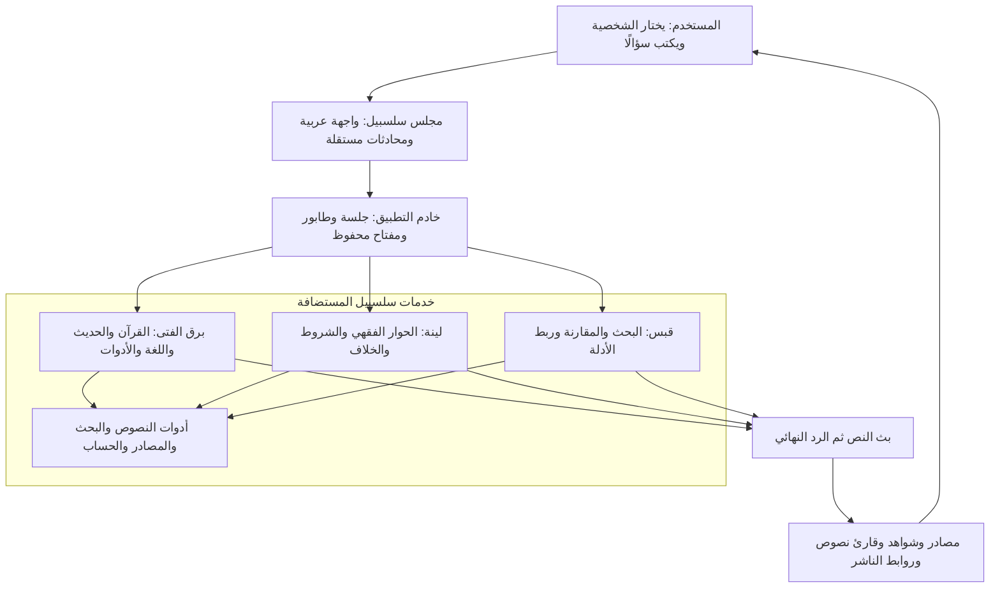
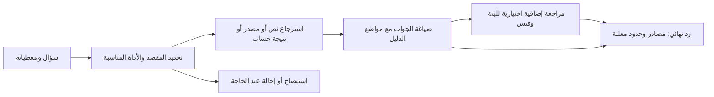
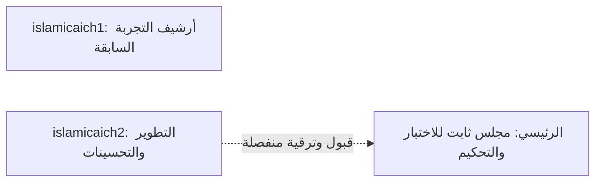

# مجلس سلسبيل: من اختيار الشخصية إلى دليل قابل للفحص

المجلس هو تجربة مشروع **برق: الذكاء العربي الموثّق لخدمة المعرفة الإسلامية**. يختار المستخدم الفتى أو لينة أو قبس، ويقرأ الإجابة أثناء بثها، ثم يفتح النص أو المرجع. يبيّن الرسم الفصل بين واجهة التحدي وخدمات سلسبيل المستضافة.

## رحلة المجلس

يحفظ الخادم المفتاح؛ لا يطلب الموقع العام من المستخدم إدخاله. تستخدم الشخصيات أدوات مشتركة، ولا يعني ذلك نقل المحادثة بينها. بعض أجوبة الفتى تتضمن زر إحالة يختاره المستخدم ويرسل السؤال الأصلي إلى لينة أو قبس. لكل شخصية سجلها المؤقت أثناء بقاء الصفحة.

## النص والاستدلال والمراجعة

هذا شرح تصميمي مبسّط؛ لا يُعرض كتتبع لكل طلب. قد تظهر مسودة أثناء البث، وتكون المراجعة الإضافية ضمن وقت الطلب وحدوده. اكتمالها ليس اعتمادًا علميًا؛ وقد يُحفظ الجواب الأصلي مع تنبيه عند تعذّرها. يظل فحص صحة الاقتباس ودلالة المصدر جزءًا من التقييم.

## أين تقع الابتكارات؟

**NMN — الذاكرة النصية المهيكلة:** تفصل هوية النص وموضعه عن الشرح، لتوجيه الاستشهاد إلى أصل يمكن مراجعته. استلهمنا الفكرة من عناية الإمام البخاري بالحفظ والضبط؛ التشابه التاريخي مصدر إلهام، وتثبت الوظيفة بأدلتها التقنية. طلبها المسجّل بحسب سجل المالك `SA 1020268774`.

**التجاور القرآني:** يقارن قرائن استعمال الألفاظ والجذور ويعرض تميّز الاقتران. يُقرأ مع الشواهد، ولا يُسوّى بعدد الورود أو التفسير القطعي. [الأبحاث والطلبات والأدلة](../docs/INNOVATION_AR.md).

**الاسترجاع والتضمين:** تظهر في [بطاقة RAG](../data-cards/rag/README.md) إيصالات مؤرخة للتضمين والفهرسة، وفي [سجل المصادر](../docs/SOURCES_AR.md) فصل بين المصدر المعتمد، والمحتوى الذي تثبت الأدلة استخدامه، وما لم يثبت استيعابه. [بطاقة SFT](../data-cards/sft/README.md) تعرض عينات تخصيص النية ونتائجها المحدودة.

## حدود الكود والمزوّد

| داخل نطاق التسليم | لدى سلسبيل بوصفها مزوّدًا مستضافًا |
|---|---|
| كود تطبيق التحدي المسموح بنشره، الوثائق، واجهة الاستخدام، قارئات المصادر، والاختبارات والأدلة المختارة | الأوزان ومصنع النماذج وقواعد المعرفة الكاملة وإعدادات التدريب والترتيب الخاصة |

مجلد `council/` يضم واجهة المجلس العامة ووحدتي الطابور وتصنيف أخطاء المزوّد المطابقتين للتطبيق المنشور، مع بيان الأصل والاختبارات ومعاينة محلية وعقد الخادم المستضاف؛ لا يحتوي على تنفيذ خدمات الشخصيات الخاص. اجتاز التصدير ٢٤ اختبارًا: ٥ لحدود المعاينة، و٦ للطابور، و١٣ لتصنيف الأخطاء. يبقى `app/` مثال API مستقلًا للفتى. **المعاينة المحلية لا تشغّل المجلس الثلاثي كاملًا**؛ تشغيله الفعلي عبر الموقع المستضاف.

ملكية أوزان الفتى لا تُعمَّم على جميع النماذج التي تستعين بها لينة وقبس. لا يلزم تسليم المزوّد نفسه لاستخدام الخدمة بمفتاح مخوّل، وواجهتا لينة وقبس لعموم المطورين لم تُعلنا متاحتين بعد. [حالة نطاق الكود والمواد](../docs/FINAL_REVIEW_AR.md).

## فصل النشر والتطوير

ثبتت ملفات المجلس في ٦ أكتوبر ٢٠٢٦. تجميد التطبيق لا يجمّد خدمات الأدوات والمصادر المشتركة. [الرابط الأساسي](https://islamicaich.salsabeel.ai/) · [الأرشيف](https://islamicaich1.salsabeel.ai/) · [حدود التشغيل والقبول](../docs/LIMITATIONS_AR.md).
