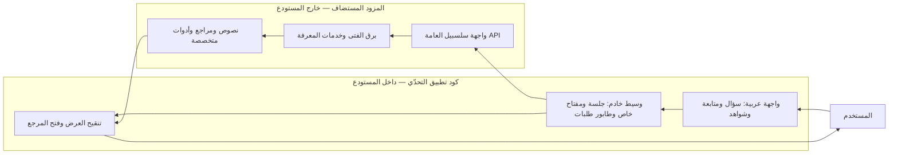
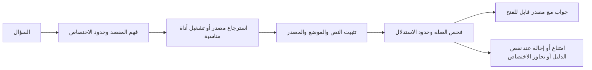

# من السؤال إلى جواب يمكن فحصه

## حدود ما نسلّمه

الخط الفاصل مقصود: يمكن للمحكّم فحص كود التطبيق وتشغيله بمفتاحه. لا يشمل ذلك نسخ الأوزان أو قواعد البيانات أو معاملات الترتيب أو ملفات التدريب الداخلية للمزود.

## المسار المعرفي المفسَّر

الرسم شرح تصميمي مبسّط؛ ليس تتبعًا مسجّلًا لكل مرحلة من طلب بعينه. تختلف مسارات الأدوات والنصوص المحفوظة عن الإجابة التوليدية العامة.

## الذاكرة المهيكلة والبصمة التجاورية

استلهمنا من حفظ الإمام البخاري ودقة ضبطه الفصل بين هوية النص ونقله من أصله وبين الشرح. المثال المرئي يعيد آية كاملة مع موضعها. لا نعدّ التشابه التاريخي دليلًا تقنيًا، ولا نجعل لقطة الواجهة إثباتًا لكل مكوّن في براءة الاختراع.

البصمة التجاورية تقارن قرائن الاستعمال القرآني للجذور. تعرض مقياس تميّز الاقتران، لا مجرد تكرار الكلمات. [البحث المنشور](https://barq.salsabeel.ai/public/reports/barq-findings-public-ar-2026-07-07.html) سابق للتحدّي؛ دمجه في العرض وتجربة المستخدم يوضح القيمة التي يوظفها التطبيق.
