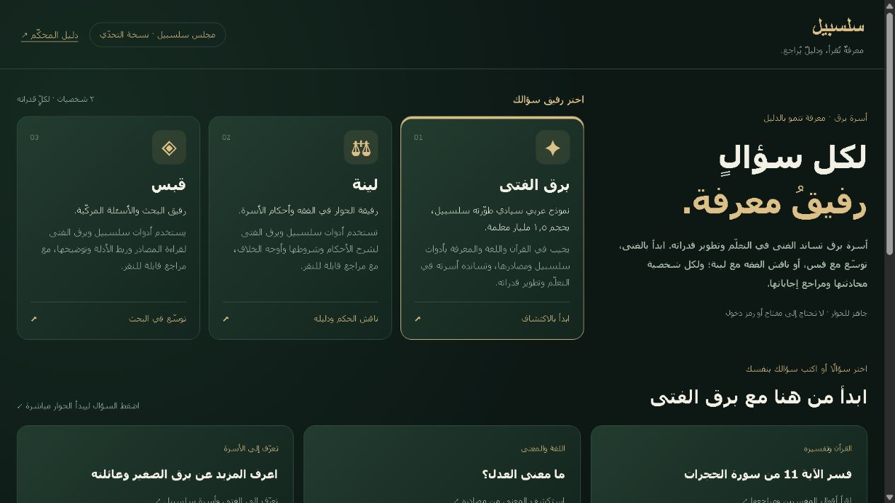
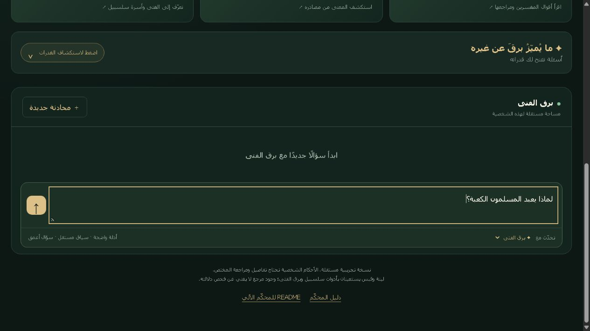
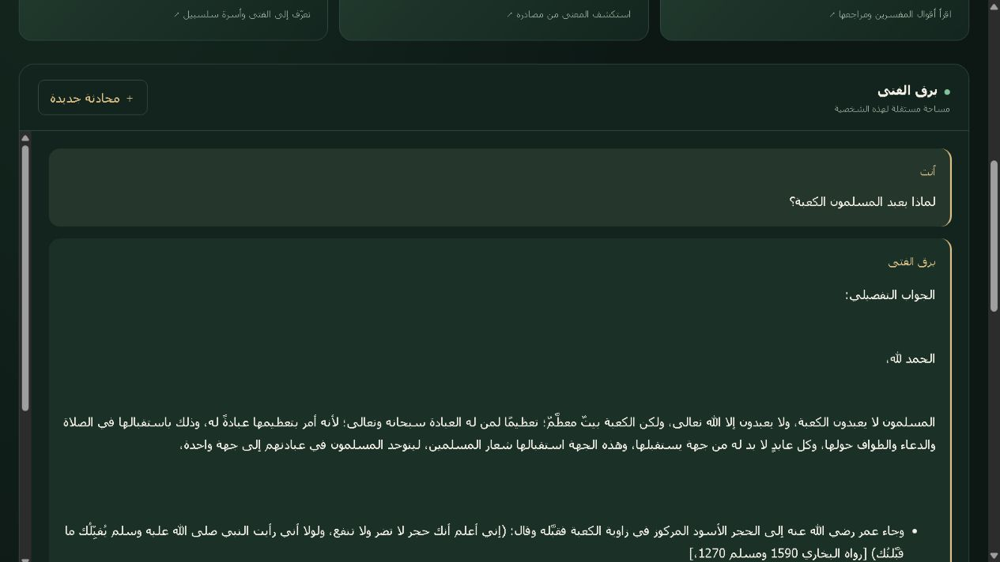
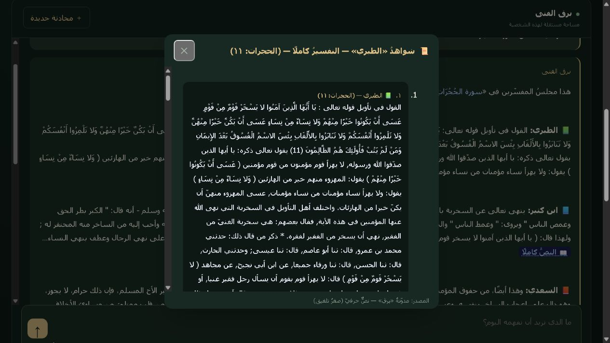
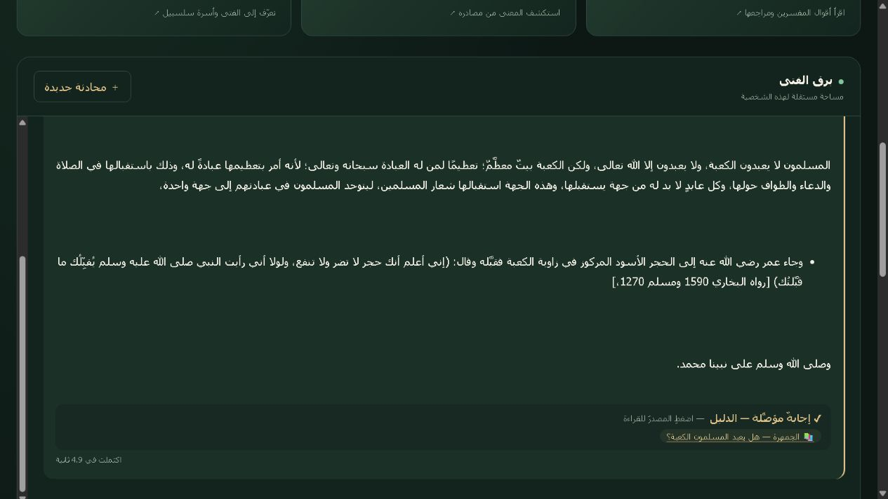
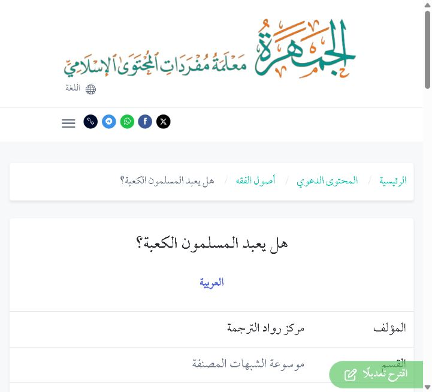
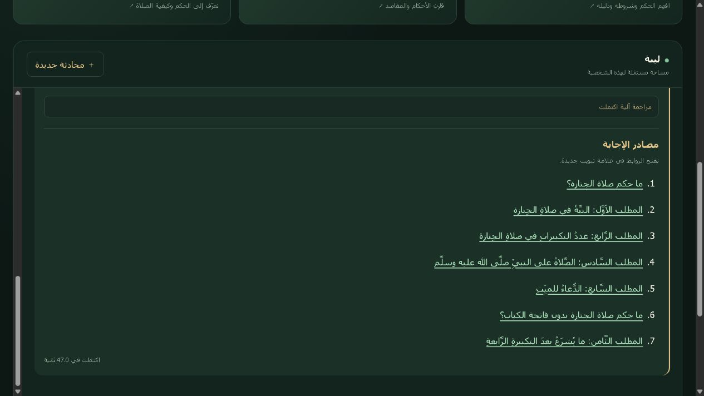

# كيف تستخدم مجلس سلسبيل؟

تجربة مشروع **برق: الذكاء العربي الموثّق لخدمة المعرفة الإسلامية** — النسخة الأساسية بتاريخ ٦ أكتوبر ٢٠٢٦.

[افتح المجلس](https://islamicaich.salsabeel.ai/) · [دليل المحكّم](https://islamicaich.salsabeel.ai/judge-guide.html) · [حالة مواد التسليم](FINAL_REVIEW_AR.md)

**اختر شخصية، اسأل، ثم افتح الدليل.** لا تحتاج إلى مفتاح API لاستخدام الموقع العام.

## ١ — اختر رفيق السؤال

اضغط بطاقة **برق الفتى** أو **لينة** أو **قبس**. ويمكنك تغيير الشخصية من قائمة «تحدّث مع» قرب خانة السؤال.

| الشخصية | اخترها عندما تريد |
|---|---|
| برق الفتى | استكشاف القرآن والحديث واللغة والشواهد وأدوات المعرفة والحساب |
| لينة | فهم حكم فقهي وشروطه والفروق والخلاف المعتبر |
| قبس | بحثًا أو مقارنة بين مفاهيم ومصادر متعددة |

## ٢ — اكتب سؤالك أو اختر سؤالًا جاهزًا

اكتب في خانة **«ما الذي تريد أن تفهمه اليوم؟»**، ثم اضغط زر السهم للإرسال. أو اضغط سؤالًا مقترحًا من «ابدأ من هنا»؛ الضغط عليه يرسل السؤال مباشرة، دون الحاجة إلى نسخه أو الضغط على الإرسال مرة ثانية. تتغير المقترحات بحسب الشخصية.

مع الفتى، افتح **«✦ ما يُميّزُ برقَ عن غيره — أسئلة تفتح لك قدراته»**، ثم افتح مجموعة واضغط سؤالها. ينتقل هذا القسم إلى أسفل الحوار بعد بدايته، ويظهر مع الفتى.

| لتجربة | مثال سؤال |
|---|---|
| تصحيح فرضية السؤال وفتح أصل الجواب | لماذا يعبد المسلمون الكعبة؟ |
| نص التفسير ومصدره | فسّر الآية ١١ من سورة الحجرات مع مصدر التفسير |
| قرائن الاستعمال والتجاور | ما الفرق بين النفس والروح؟ |
| الاشتقاقات وشواهدها | الاشتقاقات المستخدمة لرشد |
| الحديث وسنده | اعرض أحاديث الرفق بالسند |
| الفرائض التعليمية | كيف تقسم تركة قدرها 240000 على زوجة وابن وبنتين؟ |

الأمثلة توضح طريقة الاكتشاف. راجع [حدود الأدوات والأدلة](LIMITATIONS_AR.md) عند تقييم النتيجة، وحدّد المعطيات التي يحتاجها السؤال.

في سؤال مشتقات رشد، افتح «قرآن ٣» عند «رشيد» و«قرآن ١» عند «مرشد» لمراجعة مواضع الشواهد. [التجربة الحالية المسجلة](../evidence/current-witnesses-20261006.json) تربط العدّادين بالنصوص المفتوحة؛ لا تعتمد صحة الأوزان الصرفية المحيطة بهما. [خطوات إعادة الفحص](../evidence/REPLAY_GUIDE_AR.md).

## ٣ — تابع البث، ثم اقرأ الجواب النهائي

تظهر حالة الطلب والوقت، وقد يظهر انتظار للدور. يبدأ النص بالظهور قبل اكتمال الإجابة؛ انتظر النهاية قبل تقييمها أو إرسال السؤال التالي. تتعطل خيارات الإرسال والتبديل أثناء الطلب لمنع التكرار. إذا انقطع النص ووُصف بأنه غير مكتمل فلا تتعامل معه كإجابة نهائية.

## ٤ — افتح الدليل

اضغط الآية أو الشاهد أو رابط المصدر داخل الإجابة. بعض المراجع تفتح قارئًا داخل المجلس، مثل قارئ التفسير والحديث؛ وبعضها يفتح صفحة الناشر. تعرّف إلى اسم المصدر والموضع، ثم طابقه مع العبارة التي تريد التحقق منها.

مع لينة وقبس، راجع أيضًا قسم **«مصادر الإجابة»** في نهاية الرد. قد يظهر نص مقتبس محفوظ بجوار قارئ المصدر. أرقام الأحاديث المحلية هي أرقام سجل برق، وقد تختلف عن أرقام الطبعات.

هذا القارئ من تجربة النشر الفعلية للمجلس. أغلق النافذة للعودة إلى الحوار. عند فتح مرجع خارجي ستنتقل إلى صفحة الناشر كما في المثال التالي.

في المثال المصوّر، افتُتح مرجع الجمهرة رقم 92923 وطوبق أصل الجواب معه. هذه تجربة واحدة مؤرخة في ٦ أكتوبر، لا ضمان لجميع الصياغات. يمكن مقارنة [موضع النص في المرجع](../evidence/screenshots/council-kaaba-source-text.png) بالعبارة المنسوبة إليه.

اخترنا سؤال لينة «ما حكم صلاة الجنازة وما صفتها؟» من [مقترحاتها الظاهرة](../evidence/screenshots/council-linah-start.png). تعرض اللقطة سبعة مراجع وزمن هذه العينة ٤٧ ثانية؛ وهي تثبت ظهور المصادر في الواجهة، ولا تعتمد كل عبارة في الجواب علميًا.

تعني «مراجعة آلية اكتملت» انتهاء خطوة مراجعة إضافية في بعض أجوبة لينة وقبس؛ لا تعني اعتماد كل عبارة علميًا. إذا تعذرت تلك الخطوة فقد يُعرض الجواب الأصلي مع تنبيه واضح. قوّة الجواب تُفحص من النص ومصدره وصلته بالسؤال.

## ٥ — تابع أو انتقل بين الشخصيات

اكتب المتابعة في الشخصية نفسها. عند تبديل الشخصية ثم الرجوع، تستعيد محادثتها أثناء بقاء الصفحة؛ لكل شخصية سياق مستقل.

قد يظهر في بعض ردود الفتى زر **«انتقل إلى لينة وأرسل السؤال»** أو **«انتقل إلى قبس وأرسل السؤال»**. يختار الزر الشخصية ويرسل السؤال الأصلي المرتبط بذلك الرد مرة واحدة؛ لا ينقل كامل تاريخ الحوار. إذا غيّرت الشخصية من البطاقة أو القائمة فقط، فلن يرسل ذلك سؤالًا تلقائيًا.

لبدء موضوع مستقل اضغط **«محادثة جديدة»**؛ تُمسح محادثة الشخصية المختارة من الواجهة. المحادثات مؤقتة، وقد تُفقد بتحديث الصفحة أو انتهاء الجلسة. هذا لا يعني حذف سجلات الخدمة لدى المزوّد.

## عند الاستيضاح أو التعذّر

إذا طُلب توضيح، أكمل المعطيات. وإذا كانت المسألة شخصية أو تحتاج مختصًا، فالإحالة المناسبة جزء من وظيفة المساعد. أما رسالة فشل الشبكة أو التنفيذ فتعني عطلًا في الطلب، ولا تُعد امتناعًا معرفيًا. احتفظ بنص السؤال والشخصية والوقت والرسالة عند الإبلاغ عن المشكلة، دون إرسال مفاتيح أو بيانات حساسة.

الحسابات الفقهية تعليمية ومشروطة بالمعطيات، ولا تحسم نزاعًا أو واقعة شخصية. البصمة التجاورية مؤشر لقرائن الاستعمال؛ ليست عدد ورود الكلمة ولا تفسيرًا قطعيًا. بقيت ملاحظات على دقة إسناد بعض توسعات قبس؛ تحقّق من كل عبارة مؤثرة قبل الاعتماد عليها.

في إعادة تجربة «النفس والروح» على المجلس الحالي، ظهر قسم التجاور، لكن الجواب الكامل ما زال يعرض الوزن غير الصحيح «فعّل» لكلمة «النفس». افصل قراءة المؤشر الإحصائي عن صحة سائر التحليل اللغوي. لقطات الأدوات الحالية في [حزمة المراجعة](FINAL_REVIEW_AR.md) توثق مثالًا واحدًا لكل أداة.

## الخصوصية والمراجع

تجنّب إدخال أسماء أشخاص أو تفاصيل صحية أو أسرية حساسة. لا تفترض أن «محادثة جديدة» تمحو سجلات المشغّل، أو أن المحادثة محفوظة دائمًا. مدة الاحتفاظ وآلية طلب الحذف تحتاجان بيانًا معتمدًا من الجهة المشغّلة.

[المصادر المعتمدة وتغطية RAG، ومنها مِقْرأ للدكتور أيمن](SOURCES_AR.md) · [الابتكارات والأبحاث](INNOVATION_AR.md) · [حزمة المراجعة](FINAL_REVIEW_AR.md)
