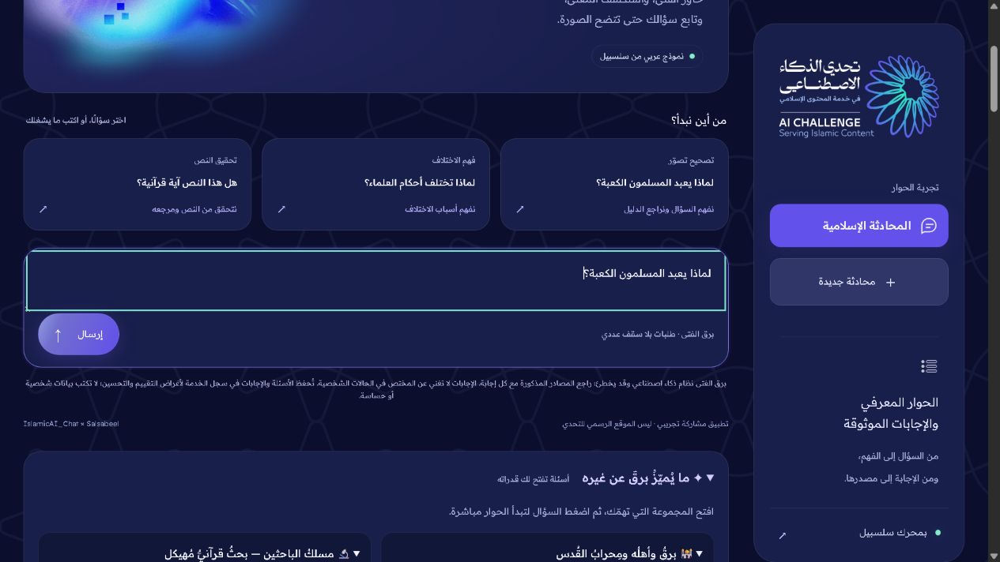
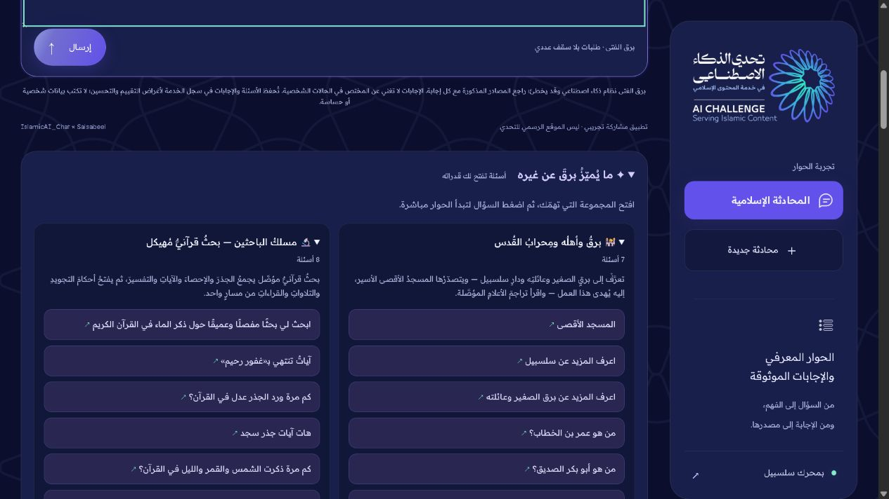
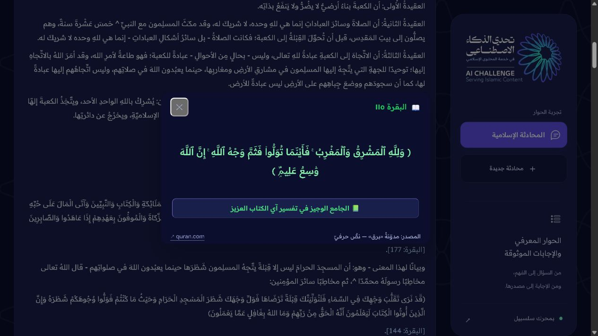

# كيف تستخدم برق؟

[افتح المحادثة](https://islamicaich.salsabeel.ai/) · [شاهد الفيلم](https://islamicaich.salsabeel.ai/beta/2-5/) · [الدليل المصوّر PDF](../presentation/Barq_User_Guide_AR.pdf)

ابدأ بسؤال واحد، ثم افتح دليله. لا تحتاج مفتاح API لاستخدام الموقع العام؛ المفتاح مخصص لمن يريد تشغيل نسخة من التطبيق.

## ١ — اكتب سؤالًا أو اختر اقتراحًا

اكتب سؤالك في خانة «كل معرفة تبدأ بسؤال…»، ثم اضغط «إرسال». يمكنك أيضًا اختيار أحد اقتراحات البداية مثل «لماذا يعبد المسلمون الكعبة؟»؛ الضغط على الاقتراح يرسل السؤال مباشرة.

## ٢ — اكتشف القدرات من الأسئلة الجاهزة

مرّر أسفل خانة الكتابة إلى «✦ ما يُميّزُ برقَ عن غيره — أسئلة تفتح لك قدراته». افتح المجموعة التي تهمك، ثم اضغط السؤال ليبدأ الحوار مباشرة. لا تحتاج إلى نسخه أو الضغط على إرسال مرة أخرى.

| ما تريد تجربته | المجموعة | السؤال |
|---|---|---|
| قرائن استعمال الألفاظ | الفروق والروابط وأوجه الرسم الواحد | ما الفرق بين النفس والروح؟ |
| الكلمات وشواهدها | فضاء الاشتقاق المبرهن | الاشتقاقات المستخدمة لرشد |
| نص الحديث وسنده | الحديث بسنده ومتنه | اعرض أحاديث الرفق بالسند |
| قسمة تعليمية | علم الفرائض — قسمة المواريث | كيف تقسم تركة قدرها 240000 على زوجة وابن وبنتين؟ |

هذه أمثلة لا ضمان لنجاح كل صياغة. في مثال النفس والروح، راجع قسم البصمة التجاورية؛ خانة الوزن الصرفي بها ملاحظة مفتوحة مسجلة في [حالة النسخة](FINAL_REVIEW_AR.md).

## ٣ — انتظر الجواب ثم افتح الدليل

تظهر رسالة حالة أثناء المعالجة. بعد اكتمال الجواب اضغط رابط المصدر المسمّى، أو زر الآية/الشاهد داخل الإجابة. تفتح بعض الشواهد في نافذة داخل الموقع، والمراجع الخارجية تفتح موقع الناشر. اضغط «إغلاق» للعودة إلى الحوار.

تحقق من اسم المصدر وموضع النص وصلته بالسؤال؛ وجود علامة توثيق وحدها ليس شهادة بصحة الجواب. بطاقة «أدلة أدوات سلسبيل» تعرض مخرجات الأداة، وقد تحتاج إلى مرجع أكثر تفصيلًا للتحقق من الاقتباس المعجمي.

## ٤ — تابع السؤال أو ابدأ موضوعًا جديدًا

اكتب سؤال متابعة في الخانة نفسها، مثل «اشرح ذلك باختصار للمبتدئ». قد تختلف جودة فهم المتابعة؛ عند الالتباس اذكر الموضوع صراحة. لبدء موضوع مستقل اضغط «محادثة جديدة». استخدم «نسخ الإجابة» إن أردت حفظ النص.

## ٥ — افهم الأعداد والحدود

البصمة التجاورية تعرض قوة تميّز الاقتران، لا عدد ورود الكلمة ولا تفسيرًا قطعيًا. في الاشتقاقات اضغط العدد أو الشاهد حين يظهر كزر. حساب الفرائض تعليمي مشروط بالورثة وصافي التركة، ولا يحسم واقعة شخصية أو نزاعًا.

إذا طلب برق توضيحًا فحدّد مقصدك. إذا امتنع أو أحال لخصوصية الحالة، فهذا تصرف مناسب داخل نطاقه. أما خطأ الشبكة أو انتهاء المهلة فليس امتناعًا معرفيًا: استخدم «إعادة المحاولة» إن ظهرت، أو انتظر قليلًا وأعد التجربة.

## الخصوصية

الموقع يعلن حفظ الأسئلة والإجابات في سجل الخدمة لأغراض التقييم والتحسين. لا تدخل أسماء أشخاص أو بيانات صحية أو أسرية حساسة. بدء محادثة جديدة لا يعني حذف سجلات المزود. مدة الاحتفاظ بالمحادثات وآلية طلب حذفها تحتاجان بيانًا من الجهة المشغلة؛ لا نقدّم مدة غير مثبتة.

## رحلة مراجعة قصيرة

سؤال الكعبة ← فتح المصدر؛ النفس والروح ← قراءة البصمة وحدودها؛ الاشتقاقات ← فتح الشاهد. يمكن مراجعة الفيلم بصوت الراوي فقط عبر أيقونة الموسيقى أعلى الفيديو. اللقطات أعلاه من الموقع الفعلي في ٦ أكتوبر ٢٠٢٦؛ لا تتضمن بيانات مستفيدين.
