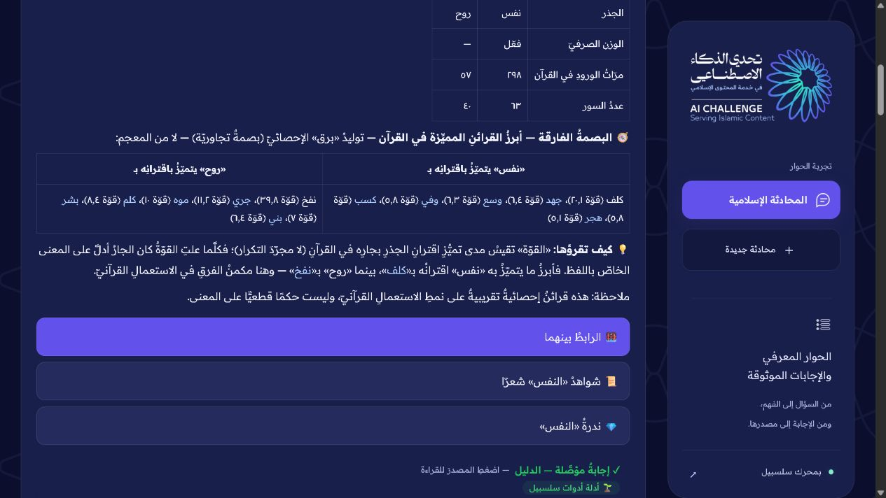

# سجل الأدلة ومسار الفحص

الادعاءات المنشورة والملفات المؤيدة وحدود كل منها موجودة بصيغة قابلة للقراءة الآلية في [claims.json](claims.json). اللقطات من واجهات فعلية؛ ليست صور واجهة مولدة. راجع [منشأ اللقطات](capture-provenance.json).

## المجلس الأساسي — ٦ أكتوبر

[إيصال الإصدار والحدود](council-release-20261006.json) · [منشأ اللقطات وبصماتها](council-captures.json).

[كتابة السؤال](screenshots/council-question.png) · [جواب الكعبة](screenshots/council-kaaba-answer.png) · [رابطه](screenshots/council-kaaba-source.png) · [المصدر المفتوح](screenshots/council-kaaba-open-source.png) · [مصادر لينة](screenshots/council-linah-sources.png) · [قارئ الطبري](screenshots/council-reader.png).

عينة الكعبة عُرضت خلال ٤٫٩ ثانية؛ عينة لينة خلال ٤٧ ثانية مع سبعة مراجع ظاهرة. هذه نتائج عينتين تحت حمل وقتهما، وليست معدل سرعة أو دقة. فحوص ٣٦٨/٦٠/٢٨ تخص نطاقات الإصدار المستضاف في إيصال النشر؛ لا تدمج مع اختبارات المستودع أو التقييم الدلالي.

## إعادة تصوير الأدوات الحالية — الشرائح ٨ و٩ و١١

[استكمال الآية](screenshots/council-nmn-current.png) · [البصمة التجاورية](screenshots/council-adjacency-current.png) · [جدول المواريث](screenshots/council-inheritance-table.png) · [إيصال الأسئلة والنتائج والحدود](current-tools-20261006.json).

هذه ثلاث محاولات جديدة على الموقع الأساسي في ٦ أكتوبر، وليست إعادة استخدام للصور السابقة. جرى توسيع عرض المتصفح لفحص عدم انقسام عناوين جدول المواريث ثم أعيد إلى حجمه؛ لم تتغير الواجهة أو النتائج. **عاد خطأ وزن «النفس» «فعّل» في القسم السابق من الجواب الحالي**. دليل التجاور مقصور على قسم البصمة الإحصائية، ولا يثبت صحة ذلك الوزن.

## الأدلة السابقة — السؤال ثم المصدر

[موضع المرجع في الجواب](screenshots/kaaba-reference-link.jpg) · [فتح المصدر](screenshots/kaaba-source.jpg). التسجيل في ٤ أكتوبر؛ إعادة التجربة اليوم قد تنتج صياغة مختلفة.

## البصمة التجاورية

الدليل المقصود هو قسم «البصمة الفارقة»: مقياس قوة الاقتران يصف تميّز الاستعمال، ولا يمثل عدد التكرارات أو حكمًا قطعيًا على المعنى. **يوجد خطأ معروف في خانة الوزن الصرفي أعلى اللقطة الأصلية**؛ لا تُستخدم هذه اللقطة لإثبات صحة الوزن. يقتصر اقتصاص الفيلم على قسم البصمة ويُصرّح بذلك.

## النص والأداة وحدود الاختصاص

[استكمال الآية](screenshots/nmn-nahl-result.jpg) · [التفسير الموسع](screenshots/tafsir-source-expanded.jpg) · [جدول المواريث الأصلي](screenshots/inheritance-table.jpg) · [لقطة الجدول الموسعة في الفيلم](screenshots/inheritance-film.png) · [الامتناع عن الفتوى الشخصية](screenshots/personal-fatwa.jpg).

لقطة الإحالة لا تثبت وجود تحويل آلي إلى مختص. جدول المواريث مثال تعليمي مشروط بالورثة وصافي التركة، ولا يثبت جميع الأحكام أو صحة كل إحالة مساندة. أمثلة العرض منتقاة، بينما مجموعة التشغيل الكاملة منشورة منفصلة في [التقييم](../evaluation/README.md).
